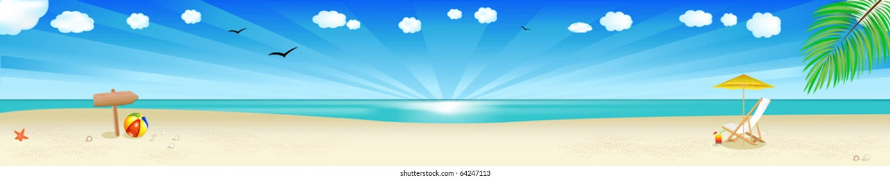

<!DOCTYPE html>
<html lang="es">
<head>
<meta charset="UTF-8">
<title>Página con tres columnas</title>
<meta name="viewport" content="width=device-width, initial-scale=1.0">

</head>
<body>

<!-- =======================
     BARRA LATERAL
     ======================= -->
<nav>
  <ul>
    <li><a href="#" onclick="mostrarSeccion('inicio-section')">Inicio</a></li>
    <li><a href="sobremi.html">Sobre mí</a></li>
    <li><a href="#" onclick="mostrarSeccion('contacto-section')">Contacto</a></li>
  </ul>
</nav>

<!-- =======================
     SECCIÓN INICIO
     ======================= -->

  <header>
    <h1>MI PRIMERA WEB</h1>
    
Soy Paula y estudio 2º de Bachillerato.

  </header>

  <!-- Banner después de la presentación -->
  

    
  

  

    

      <h2>Mis Hobbies</h2>
      <table border="1">
        <tr>
          <td></td>
          <td></td>
        </tr>
        <tr>
          <td></td>
          <td></td>
        </tr>
      </table>
    

    

      <h2>Enlaces a mis lugares favoritos</h2>
      
Aquí te muestro unos enlaces a mis lugares favoritos.

      <ul>
        <li><a href="https://www.islacanela.es/que-hacer/playa-isla-canela">Playa Isla Canela</a></li>
        <li><a href="https://www.realbetisbalompie.es/club/estadio-benito-villamarin">Estadio Benito Villamarín</a></li>
        <li><a href="https://www.visitportugal.com/es/destinos/porto-e-norte/73739">Vila Real</a></li>
      </ul>
    

  

<!-- =======================
     SECCIÓN CONTACTO
     ======================= -->

  <h2>Contacto</h2>
  
Rellena este formulario para contactar conmigo:

  <!-- FORMULARIO DE GOOGLE FORMS -->
  <iframe src="https://docs.google.com/forms/d/e/1FAIpQLScJntN7aHK4rLLbJeq--NAlo75JdInqmOniuaEPBylzdqt6hg/viewform?embedded=true" 
          width="100%" height="800" 
          frameborder="0" marginheight="0" marginwidth="0">Cargando…</iframe>

<!-- =======================
     PIE DE PÁGINA
     ======================= -->
<footer>
  
© 2025 Mi sitio web | Todos los derechos reservados

</footer>

<!-- =======================
     BOTÓN IR AL INICIO
     ======================= -->
<button id="btnInicio" onclick="window.scrollTo({ top: 0, behavior: 'smooth' });">↑ Inicio</button>

</body>
</html>
